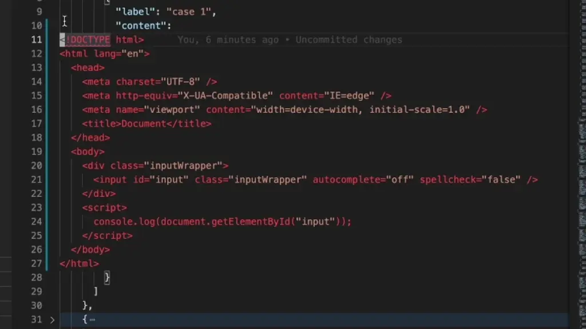

# Script

Create scripts with VS Code extension capabilities.

## Install via CLI

```bash
code --install-extension zjffun.script
```

## Usage

### Create a script

```js
export default ({ vscodeExtra }) => {
  const { replaceSelections } = vscodeExtra;
  replaceSelections((text) => {
    return JSON.stringify(text.split("\n"), null, 2);
  });
};
```

### Config keyboard shortcuts

```json
{
  "key": "cmd+5 l",
  "command": "script.run",
  "args": {
    "script": "[script path]"
  }
}
```

### Run script



## Release Notes

### [TODO]

### [Unreleased]

### v0.0.1

- Added features run scripts.
